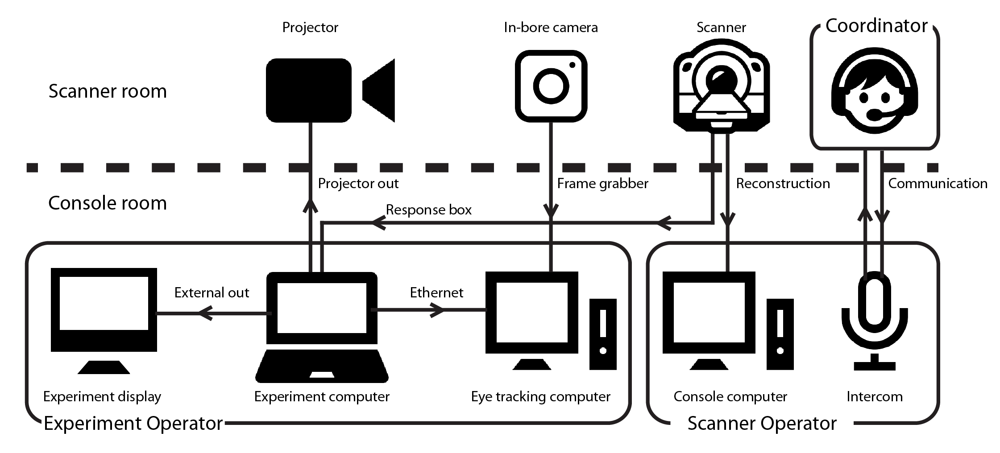
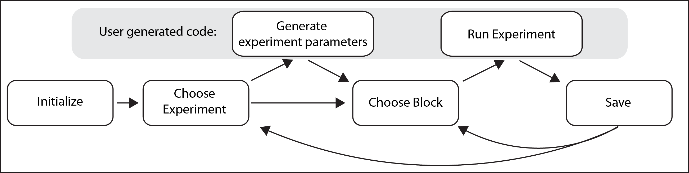

# experiment_menu
## V_1.0

Typical experimental code for fMRI assumes a regular block order with few interruptions. This is fine in many cases but when testing populations where interruptions are typical and blocks may need to be re-run or changed unexpectedly, such as with developmental or patient populations, this kind of linear, rigid code is inappropriate. This repository contains code for running an experiment menu system using PsychToolBox 3 (PTB3) that allows you to navigate between experiments and blocks in a way suitable for testing unpredictable populations. This code has a number of properties that make it appropriate for those populations:

>Modular: Experiments can be added or removed easily, and can be hidden while they are being developed. Experiments can talk to one other too  
>Flexible: Almost all experiments that can be run in PTB can be implemented here  
>Stable: Code has many tools for graceful exits, regular saving and reloading data  

The main script you want to run is Menu.m found in the 'Scripts' folder. This will generate a text based menu that allows you to navigate between experiments that have been created, all the while storing and formating the data from the experiments. Below is a thorough description of how the menu system works and what you would need to do to adapt it for your computer set up and to create a new experiment. 

This has been tested on PTB 3.0.X but mainly on Macs and Linux. Mileage may vary. 

## Setup

For running infant participants in the scanner, for which this code was original purposed, the schematic below shows the devices and people involved. Inside the scanner room, a coordinator will communicate with the parent, directly monitor the infant and communicate with the experimenters in the console room the projector (either with a headset or with hand signals). The in-bore camera and projector are connected to computers inside the console room. In this room, the experiment operator controls the experiment computer that sends stimuli to both the projector and a monitor inside the console room. The experiment operator also monitors the videotracking feed from the in-bore camera. The scanner operator controls the scanning sequences and alignment, as well as the communication with people in the console room.

The hope is that very little in this code needs to be changed in order to set up this code on a new system. The only part where special information must be added is in the section titled 'DEFAULT PARAMETERS' at the top of the script. For instance you will need to specify the TR duration if using this for scanning in order for the code to know when to expect an incoming TR.

To add a new eye tracker you will need to add information to each 'Utils_EyeTracker*' script about how different calls are turned into
interactions with the eyetracker.

To add new hardware you have to perform a few steps:

>Keyboard: Make sure that the keyboard can be detected. This requires that you specify in the labelled \% KEYBOARDS the name of the keyboards as they are identified by GetKeyboardIndices (or the number index from that same function). In this section you must also specify the name of the button box that receives the scanner responses and triggers (set up for a Current Designs system called '932'). Note that this code typically assumes that there are two keyboards attached. One for the participant to respond with and will be the device the code listens for in terms of the scanner trigger, the other is the keyboard that the experimenter uses to navigate. When only one keyboard is found (e.g. when the scanner is not connected), this is used for all of those inputs.  
>Eyetracker: If you are using EyeLink, iViewX or the recommended frame grabber solution then you only need to specify 'EyeLink', 'iViewX' or 'FrameGrabber' in the section below that says \% EYETRACKER. If you want to add a new eye tracker system you will need to add lines to the files Utils_EyeTracker_\*  
>Screen: If you have a new display system you want to add then edit the 'Scripts/Setup_Display.m' function. At a minimum, this requires that you specify the screen to display to (set Window.onScreen), the screen size and viewing distance. This can deal with distortions that use the 'GeometryCorrection' flag in 'PsychImaging'.  

We STRONGLY advise that you extensively debug any of your code using this system to ensure that you are getting reasonable timing information and that it does not crash when you change the configuration (e.g. it might run fine on a laptop but then not recognize that the scanner is connected when it should).

Various scripts are supplied herein to support the initial set up of the scanning environment. For instance, the Scripts/Scanner_Calibration/ folder contains scripts on setting up a display without different types of distortion (e.g. removing a curvature, keystoning, stretching/compression and translation) that is useful if you are projecting on to the ceiling of the bore. Scripts/Experiment_ImDisplay_Pilot.m allows you to easily measure the size of the calculated visual angle relative to the size of the image. Utils_EyeTracker_UDP_Test_Send.m allow you to test the sending of messages between computers across an ethernet connection.

## Initializing the menu

To run the Menu code you can provide only one input, the participant name (if nothing is provided, it will assume the name 'Pilot'). Upon running Menu.m, various questions will be asked to set up the environment (once they have been set, you can change them within the options submenu), as listed below. If you provide more inputs to Menu.m then these can be used to answer these questions and thus more quickly navigate through the options at start up (e.g. Menu('P001', 'load_l', 'scanner_n') to run the P001 participant, load their previous data that is stored and assume you aren't connected to the scanner). The questions are:
  1. Do you want to load the data? 
      This question only appears if the file already exists in the Data folder. you can then load the data, overwrite it, or abort/quit from the menu
      To preselect the answer: Prefix: load_; Options: l[oad], o[verwrite], a[bort]
  2. Are you connected to the scanner? 
      If you are connected to a scanner then you should say yes. This will make the code hang on triggers
      To preselect the answer: Prefix: scanner_; Options: y, n
  3. Which screen do you want to connect to? 
      What screen would you like to setup the menu to? This can mean extending to a second display, projecting to the main screen (with or without showing the menu text on that screen), or creating a transparent screen which the display plays on.  
      To preselect the answer: Prefix: window_; Options: 1-9, s[elf], p[ilot], t[ransparent] or y
  4. Are you connected to the eye tracker? 
      Do you want to connect to the default eye tracker that is specified in the code below? If so, it may initiate a calibration
      To preselect the answer: Prefix: eyetracker_; Options: y,n 
  5. Which Experiment? 
      Specify from the list the experiments available that you wish to run
      To preselect the answer: Prefix: Experiment_; Options: 1-9 or (if more than 9 options are available) 01-99
  6. Which Block? 
      Specify from the list of experiment blocks available that you wish to run
      To preselect the answer: Prefix: Block_; Options: 1-9 or (if more than 9 options are available) 01-99

## Navigation through menu

The overall structure of the menu system is depicted in the figure below. The text to follow describes the navigation throughout the menu system more thoroughly.

Once you have set up the environment, either by pre-specifying the call to the 'Menu' function or by responding to the questions when the code is launched, you will be put in the menu for choosing between experiments and blocks (also happens after a block finishes). There are three steps to experiment navigation: experiment selection, block selection and confirmation.

To select experiments and blocks you press numbers associated with the experiments, as printed in the command window. The program will wait for either the max number of characters for the options available (say if you have 12 options then if you press two keys it assumes you have confirmed your response) or until you press enter/return. When selecting an experimental block, roman numerals will be displayed at the start of the block name if it has been run before to indicate how many times it has been run.

At any time during this menu navigation you can press 'b' to go back to the main menu where you choose experiments. If you are in an experiment and you would like to return to the menu you can press 'q' (although this is up to the user to make code that can gracefully exit). If you would like to quit the menu and close all the screens, press 'q' from the menu and confirm with 'y'. Alternatively, you can just press 'q' several times from the menu.

After an experimental block you may be given the option of running the next block in that experiment by pressing 'y'. If you want to pick another block then you can type that number. You can press 's' to redisplay all the block options. If you want to replay a block press 'r'. If you wish to autoplay blocks without requiring responses, then in the experiment, specify the field: 'Data.NextBlock' with a string/number corresponding to a block. This autoplay can be stopped at any time by pressing 'q': you will be taken to the menu and navigate as you wish. 

To allow for the brain's response to return to baseline, after an experiment block a timer is initated which waits a certain amount of time before the next block can be started. A typical wait time is 6s, in order to deal with hemodynamic decay, but can be anything and is specified by 'Data.Timing.DecayLapse' in the experiment. This will be printed in the command window when it elapses and should represent the time when the scanner is turned off after a scan too.

The code will detect if the scanner hasn't been heard for a few TRs and will assume the scanner has been stopped. After this happens it will make the next experiment block wait for a burn in period. The experiments will hang and say they are waiting for burn in to elapse before they initialize.

In the experiment menu it is possible to go to 'Options' in which you can change some global parameters like whether the scanner is connected, whether the eye tracker is being used or if you want to delete data associated with an experiment. This may be useful if you accidentally run an experiment before you intend to (since some experiments have contingencies with other experiments). You can also initiate a pause since waiting in the menu is a computationally intensive process (the key press loops are tight in order to catch as many TRs as possible). You can also alter the default parameters of an experiment if this functionality is added. Specifically, if a file called GenerateTrials_Modify_\* exists then it can modify that corresponding experiment parameters.

If you press 'v' in the experiment menu then you will jump to the PlayVideo experiment and be in that menu, thus allowing you to show videos quickly. This even ignores any wait after an experimental block ends so be careful about pressing it if you want to keep the proceeding block's data. 

If you press 'j' in the experiment menu then you will enable a note to be written: you can now type whatever you wish in the command window. Since Diary stores the output to the command window then this can be read later. This does not interrupt listening to the scanner although because it is listening to the scanner the keyboard may lag. Press Return/Enter to finish typing and go back to the menu

## Adding experiments to the menu

To add an experiment the two encapsulated functions necessary are 'GenerateTrials_${NAME}' and 'Experiment_${NAME}'.

**GenerateTrials_\*** should output all task relevant randomization information, such as stimulus sequence, stimulus timings, stimulus positions etc. that must be balanced across blocks. The input to GenerateTrials is the outputs of other GenerateTrials and the blocks that
have been run (so you can see what stimuli have been used), as well as the Data structure (what has been done) and Window structure (To allow you to interface with the GenerateTrials when necessary). Some will depend on other experiments having been run, some will depend on stimuli not being used by other experiments. This file can be set up in any way although a required division is that it outputs a structure which further divides into Parameters (containing knobs to turn that alter experiment set up) and Stimuli.GenerateTrials requires three elements in order to interface with Menu: Parameters.BlockNum (how many blocks there are in this design), Parameters.BlockNames (the names for the different blocks so that they can be named in the selection of blocks) and Parameters.SelectedStimuli_Names (a cell with what the names of the used stimuli).

**Experiment_\*** runs an experiment presentation code. It outputs the data generated from the experiment (timing information, eye tracker data etc.) and takes as an input the block number, the relevant window and interface information (a set of PTB relevant parameters and other things like when the next TR is expected) and the output of the GenerateTrials_ function. This function must output Timing.DecayLapse as a value, specifying when in clocktime the next experiment can start (this will be doubled if you don't run the same experiments consecutively). Moreover, it must have a substructure called Timing.TR that stores all recorded TRs. To help analysis there must also be substructures called TestStart and TestEnd to say when the block started and ended (usually reflecting just before the stimuli start). These functions should be set up so that a 'q' key press will almost immediately (sometimes 'q' needs to be pressed multiple times) terminate the function and return it to menu. Relatedly, these must output a field with Quit as a logical value, stating whether the experiment was terminated or not. Do not call ListenChar in these functions or vary priority but if you do, return them to their original state before going back to the menu. At the start of the experiment you probably want to use the function: Setup_WaitingForScanner which will make the experiment hang and wait for triggers at burn in if appropriate. It would be good to mention somewhere how many blocks are necessary for adequate power. You ought to send messages to the eye tracker signalling: the start of the block, trial onset, stimulus onset, trial offset, block end.

To summarize:

GenerateTrials_[NAME]:
>Inputs
>1. All the outputs of GenerateTrials
>2. All the blocks that have been completed
>3. The data for this participant
>4. Interface information like screen sizes and fMRI set up

>Outputs
>1. 'Parameters.BlockNum'- How many blocks of this experiment are there?
>2. 'Parameters.BlockNames'- What are the block names?
>3. 'Stimuli.SelectedStimuli_Names'- What are the stimulus names if necessary
>4.  Whatever additional task details necessary  
>Options: Stimuli.EyeTrackerCalib_Locations - Additional locations to test in the calibration

Experiment_[NAME]:
>Inputs
>1. Block that was selected
>2. Interface information like screen sizes and fMRI set up
>3. The GenerateTrials output for this experiment (and none others)
>4. Participant data that has been collected so far

>Outputs
>1. 'Timing.DecayLapse'- When (clocktime) can the next experiment begin?
>2. 'Timing.TR' - A vector containing all of the time stamps of TRs recorded in this experiment. Should be empty if there were no TRs received
>3. 'Quit' - Was the experiment terminated early (and hence the block was not completed)
>4. 'TestStart' - What is the first moment after the burn in
>5. 'TestEnd' - What is the moment that the experiment ends
>6. Whatever additional information you want. It is encouraged that you store Stimulus information  
>Options: 'NextBlock' - Automatically advance to the next block

If you are debugging a new experiment you should name the function with '\_Pilot' on the end. This means that the code will only appear when your SubjectID is 'Pilot'. Relatedly, if you wish to hide some code (potentially because the experiment is no longer being run) then simply append '\_Hide' to the title.

An eye tracker calibration script is included here to use with the framegrabber eye tracking option. In addition to the default 9 locations that are used for the eye tracking calibration, sometimes it will be useful to evaluate other locations, such as the locations of stimuli in a task. To add new locations, make a N x 2 matrix called Stimuli.EyeTrackerCalib_Locations in your GenerateTrials that describe the X,Y position of these points in visual degrees displacement of these locations relative to the origin. When the calibration is then run, these locations will then be included as sampled fixation points. The GenerateTrials that specify these locations must be made before the calibration is run or this won't work (or you could delete the GenerateTrials of the calibration and then re-run it).

It is encouraged that many outputs of experiments be printed to the command line so that progress can easily be tracked. The outputs to the command window are all saved using the Diary function. 

It is also encouraged that you record any stimulus related information in the Data structure to be outputed. Although this could be retrieved from GenerateTrials, that might be a pain if you delete GenerateTrials (although it is never actually deleted, it just goes to the 'Trash' structure).

## License
This program is free software: you can redistribute it and/or modify it under the terms of the GNU General Public License as published by the Free Software Foundation, either version 3 of the License, or (at your option) any later version.

This program is distributed in the hope that it will be useful, but WITHOUT ANY WARRANTY; without even the implied warranty of MERCHANTABILITY or FITNESS FOR A PARTICULAR PURPOSE. See the GNU General Public License for more details.

You should have received a copy of the GNU General Public License along with this program. If not, see <http://www.gnu.org/licenses/>.
