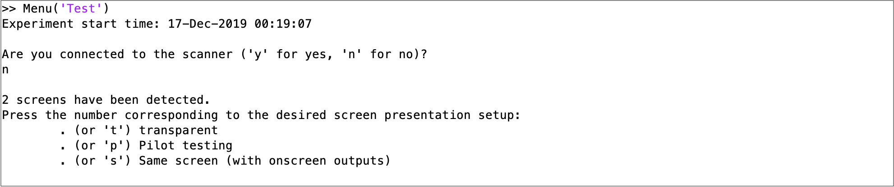
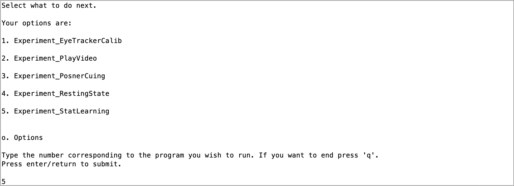
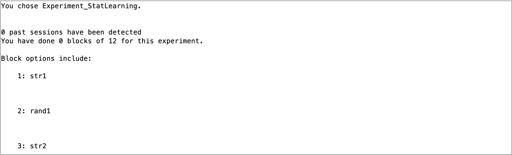
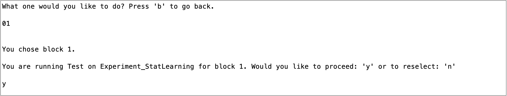
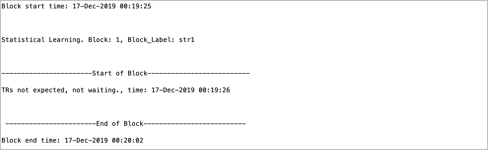
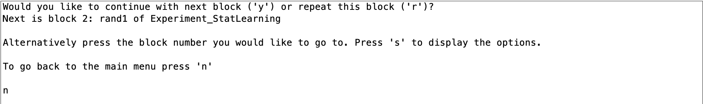
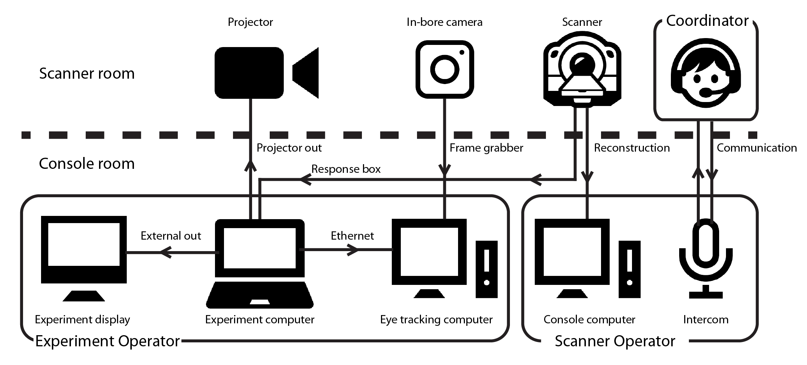

# experiment_menu
## V_1.1

Typical experimental code for fMRI tasks assumes a regular block order with few interruptions. This is appropriate in many cases, but when testing populations where interruptions are typical and blocks may need to be re-run or changed unexpectedly---such as with developmental or patient populations---this kind of linear, rigid code is non-optimal. 

This code was developed primarily for collecting data from awake, behaving infants. When scanning infants, every moment is unpredictable. When infants are in the scanner it is a novel and potentially scary place and we have found that infants are most calm when they have something to watch. Even so, infants can get fed up with an experiment at a moments notice. If we can change between experiments or resume them without any delay (other than what is required for fMRI baselining) then this will maximize the likelihood of a successful scan. Moreover, when scanning infants there will be a number of moments of downtime where we are not conducting experiments, such as when they first go in the scanner until the scout/localizers have run, or during anatomical images. Cycling through hundreds of videos during these moments to find ones that can soothe the infant will maximize their happiness and the chance of a successful scan.  

To build code that satisfies these goals is no easy feat. The current repository contains code for running an experiment menu system using PsychToolBox 3 (PTB3) that allows users to navigate between experiments and blocks flexibly as to be suitable for testing unpredictable populations. This code has a number of properties that make it appropriate for those populations:

>Modular: Multiple experiments can be added or removed from the menu easily, and can be hidden from new participants while scripts are being developed. Despite modularity, experiments can share information if desired. For instance, an experiment can use the images seen from previous experiments in a session to determine the images it ought to show  
>Extendable: All experiments that can be run in PTB (that we can think of!) can be incorporated into the Menu  
>Retention: The code has many tools for graceful exits, regular saving and reloading data. This means that more data is retained when possible, encourages experimenters to take breaks when necessary and means that nothing is ever deleted accidentally due to user error  
>Stable: The code has been tested in over a hundred fMRI sessions with infants, as well as innumerable fMRI and behavioral sessions with adults. Metadata is saved within the menu system automatically and all text outputs are logged  

The main script you want to run is `Menu.m` found in the 'Scripts' folder in this repository. This will generate a text-based menu that prints to the MATLAB command window to allow you to navigate with the keyboard between experiments that have been created, all while storing and formatting the data collected from the experiments. Although the text-based system may seem clunky at first, expert users can navigate it faster than any point-and-click tool imaginable. Below is a thorough description of how the menu system works and what you would need to do to adapt it for your computer set up and to create a new experiment.  

This has been tested on PTB 3.0.X on Macs and Linux and MATLAB versions newer than 2014a. In accordance with the advice from PTB it is recommended that you use a Linux system for running this code to ensure timing. In addition to the basic PTB install you will also need to install gstreamer in order to play movies. Gstreamer can be difficult to setup, in my experience version 1.14.4 works best with PTB. With all of this, mileage may vary by system, send feedback if you have compatibility issues. 

Despite being set up to work with fMRI, this code can and has been used easily applied to behavior-only research. Same goes for eye tracking. In this way, this repository can serve as a boilerplate infrastructure for running PTB3 experiments in a consistent framework.

In addition to the code here, there is also a sister repository [infant_neuropipe](https://github.com/ntblab/infant_neuropipe) which contains a semi-automated pipeline for analyzing data produced by this code.  

## Workflow of using the menu

The overall structure of the menu system is depicted in the figure below.  

Here we show that the menu is first initialized with a set of environmental parameters (e.g. are you connected to a scanner, are you doing eye tracking, on what display do you want to show the stimuli etc.).   

Next you are taken to the main page where you can choose between several experiments. We have provided you with a few example experiments to get started.  

After selecting an experiment you then choose a block. You can have any number of blocks and these blocks can be as short or long as you like and can be in any order chosen. Once you have chosen your block you must confirm your choice.  

The block then runs, displaying stimuli to the participant. At the start of the block, the code could hang to wait for the scanner or initiate the eyetracker.  

Once the block is finished, the stimuli disappear and the experimenter 'regains' control of navigating through the menu. They can then choose to redo the block, choose a different one or go back to the menu.  

## Setup/installation

For running infant participants in the scanner, for which this code was originally purposed, the schematic below shows the devices and people involved. Inside the scanner room, a coordinator communicates with the parent, directly monitors the infant and communicates with the experimenters in the console room (either with a headset or with hand signals). The in-bore camera and projector are connected to computers inside the console room. In this room, the experiment operator controls the experiment computer that displays stimuli to both the projector and a monitor inside the console room. The experiment operator also monitors the videotracking feed from the in-bore camera. The scanner operator controls the scanning sequences and alignment, as well as the communication with people in the console room.

To start using this code, clone this repository and then the scripts should be executable in MATLAB. No other installation is necessary.

The hope is that very little needs to be changed in order to set up this code on a new system. The only part where special information must be added is in the section titled 'DEFAULT PARAMETERS' at the top of the `Menu.m` script. For instance, you will need to specify the TR duration if using this for scanning in order for the code to know when to expect an incoming TR.

To add new hardware you have to perform a few steps:

>Keyboard: Make sure that the keyboard can be detected. This requires that you specify in the \%KEYBOARDS section of the Menu.m script the name of the keyboards as they are identified by GetKeyboardIndices (or the number index from that same function). In this section you must also specify the name of the button box that receives the scanner responses and triggers (set up for a Current Designs system called '932'). Note that this code typically assumes that there are two keyboards attached: one 'keyboard' is for the participant to respond with as well as the keyboard code for the scanner trigger, and one keyboard for the experimenter to navigate the menu. When only one keyboard is found (e.g. when the scanner is not connected), this is used for all of those inputs. Hence, for behavioral studies one keyboard is sufficient.  
>Eyetracker: If you are using EyeLink, iViewX or the recommended frame grabber solution, then you only need to specify 'EyeLink', 'iViewX' or 'FrameGrabber' in the section below that says \%EYETRACKER in the menu script. If you want to add a new eye tracker system you will need to add information about this eye tracker to the files `Utils_EyeTracker_\*`. For instance, when the menu wants to turn the eye tracker on, you need to tell matlab what to do in order to turn the eye tracker on  
>Screen: When navigating through the menu you can display to the second monitor (option: 'Pilot') or to the same screen (option: 'Same'), but if you have a unique way of presenting your stimuli (e.g., onto the surface of the bore), or you want to change the default window size for calculating visual angle, then you will need to edit the `Scripts/Setup_Display.m` function. At a minimum, this requires that you specify the screen to display to (set Window.onScreen), the screen size and viewing distance. This can undistort the projected image using 'GeometryCorrection' flag in 'PsychImaging', which is useful when projecting onto the ceiling of the bore like we do in our work.  

When you make any changes to the configuration, we STRONGLY advise that you extensively debug any of your code using this system to ensure that you are getting reasonable timing information and that it does not crash (e.g. it might run fine on a laptop but then not recognize that the scanner is connected when it should).

Various scripts are supplied herein to support the initial set up of the scanning environment. For instance, the 'Scripts/Scanner\_Calibration/' folder contains scripts on setting up a display without different types of distortion (e.g. removing a curvature, keystoning, stretching/compression and translation) that is useful if you are projecting on to the ceiling of the bore, like we do in our infant neuorimaging. `Scripts/Experiment_ImDisplay_Pilot.m` allows you to easily measure the size of the calculated visual angle relative to the size of the image. `Utils_EyeTracker_UDP_Test_Send.m` allow you to test the sending of messages between the stimulus display computer and eye tracking computer across an ethernet connection.

## Initializing the menu

To run the Menu code you only need to provide one input: the participant name. If nothing is provided, the code will assume the name 'Pilot'. Upon running Menu.m, various questions will be asked to set up the environment, as listed below. Once they have been set, you have the option to change them within the 'Options' submenu. You can also provide more inputs to `Menu.m` to answer these questions and thus more quickly navigate through the options at start up (e.g. `Menu('P001', 'load_l', 'scanner_n')`) to run the P001 participant, load their previous data that is stored and assume you aren't connected to the scanner). The questions are:
  1. Do you want to load the data?  
      This question only appears if the file already exists in the Data folder. You can then load the data, overwrite it, or abort/quit from the menu  
      To preselect the answer: Prefix: load_; Options: l[oad], o[verwrite], a[bort]
  2. Are you connected to the scanner?  
      If you are connected to a scanner then you should say yes. This will make the code hang for triggers before starting a block if you use 'Setup_WaitingForScanner.'  
      To preselect the answer: Prefix: scanner_; Options: y, n  
  3. Which screen do you want to connect to?  
      What screen would you like to setup the menu to? This can mean extending to a second display, projecting to the main screen (with or without showing the menu text on that screen), or creating a transparent screen which the display plays on.   
      To preselect the answer: Prefix: window_; Options: 1-9, s[elf], p[ilot], t[ransparent] or y  
  4. Are you connected to the eye tracker?  
      Do you want to connect to the default eye tracker that is specified in the code below? If so, it may initiate a calibration (e.g. for EyeLink)  
      To preselect the answer: Prefix: eyetracker_; Options: y,n  
  5. Which Experiment?  
      Specify from the list the experiments available that you wish to run  
      To preselect the answer: Prefix: Experiment_; Options: 1-9 or (if more than 9 options are available) 01-99  
  6. Which Block?  
      Specify from the list of experiment blocks available that you wish to run  
      To preselect the answer: Prefix: Block_; Options: 1-9 or (if more than 9 options are available) 01-99  

## Making the most of the Experiment_Menu

Learning to navigate the menu system quickly is essential to making the most of what it can offer. New users typically train for weeks with adults before they run infant scans. In this time, they learn how to rapidly change between sections of the menu in order to minimize any downtime in the experiment. Below we explain some useful tips on navigating the menu.

Once you have set up the environment, either by pre-specifying the call to the 'Menu' function or by responding to the questions when the code is launched, you will be put in the menu for choosing between experiments and blocks. There are three steps to experiment navigation: experiment selection, block selection and confirmation.

To select experiments and blocks you press numbers associated with the experiments, as printed in the command window. The program will wait for either the max number of characters for the options available (say if you have 12 options then if you press two keys it assumes you have confirmed your response) or until you press enter/return. When selecting an experimental block, roman numerals will be displayed at the start of the block name if it has been run before to indicate how many times it has been run. This means that if you take a break and want to resume, you know where you got up to.

At any time during this menu navigation you can press 'b' to go back to the main menu where you choose experiments. If you are in an experiment and you would like to return to the menu you can press 'q' (although this is up to the user to make code that can gracefully exit, see PosnerCuing for an example). If you would like to quit the menu and close all the screens, press 'q' from the menu and confirm with 'y'. Alternatively, you can just press 'q' several times from any place in the menu code.
 
After an experimental block you may be given the option of running the next block in that experiment by pressing 'y'. If you want to pick another block then you can type that number. You can press 's' to redisplay all the block options. If you want to replay a block press 'r'. If you wish to autoplay blocks without requiring responses, then in the experiment script, specify the field: `Data.NextBlock` with a string/number corresponding to the next block. This autoplay can be stopped at any time by pressing 'q': you will be taken to the menu and navigate as you wish.

To allow for the brain's response to return to baseline, after an experiment block a timer is initiated which waits a certain amount of time before the next block can be started. A typical wait time is 6s, in order to deal with hemodynamic decay, but can be anything and is specified by `Data.Timing.DecayLapse` in the experiment code. This will be printed in the command window when it lapses. The appearance of that message should be used as an indicator that the scanner can be stopped at the end of a run. If switching between experiments (rather than blocks within an experiment), this lag is doubled in order to make the difference cleaner.

The code will detect if the scanner hasn't been heard for a few TRs and will assume the scanner has been stopped. After this happens it will make the next experiment block wait for a burn in period. The experiments will hang and say they are waiting for burn in to elapse before they initialize. The default burn in time is 3 TRs.

From the main menu, it is also possible to go to 'Options' in which you can change some global parameters like whether the scanner is connected, whether the eye tracker is being used or if you want to delete data associated with an experiment. The latter may be useful if you accidentally initiate an experiment before you intend to (since some experiments have contingencies with other experiments). You can initiate a pause to stop listening to anything. Finally, you can also alter the default parameters of an experiment if this functionality is added. Specifically, if a file called `GenerateTrials_Modify_\*` exists then it can modify that corresponding experiment parameters using the functionality that the script provides. Check out `GenerateTrials\_Modify\_PlayVideo.m` for an example.  

If you press 'j' in the main menu then you will enable a note to be written: you can now type whatever you wish in the command window. Since Diary stores the output to the command window then this can be read later. This does not interrupt listening to the scanner although because it is listening to the scanner the keyboard may lag. Press Return/Enter to finish typing and go back to the menu.  

Finally, an important shortcut for development research is 'v'. If you press 'v' from any part of the menu (although not from within experiments unless explicitly programmed) then you will jump to the PlayVideo experiment submenu, thus allowing you to show videos quickly. This even ignores any wait after an experimental block ends so **be careful** about pressing it if you want to keep the preceding block's data.  

## Using the Menu for behavioral experiments

The menu can and has been used for behavior-only experiments with infants and adults.  We think much of the functionality we built into this code would be valuable for labs to adopt in order to make stable platforms that minimize the risk of errors and make it easy for research assistants or people otherwise unfamiliar with specific experiments to run experiments. 

To adapt the code to behavior-only experiments, there are only two things to do. Firstly, built into the code is infrastructure to support fMRI data collection but this can be ignored by specifying that you aren't connected to the scanner. Secondly, this code assumes that you want to insert breaks between blocks of a fixed duration but it is entirely possible to vary the inter-block interval (referred to in code as the DecayLapse) to accommodate your experiment.

## Adding experiments to the menu

To add an experiment the two encapsulated functions necessary are 'GenerateTrials\_${NAME}' and 'Experiment\_${NAME}'. These two scripts are necessary in order to make a distinction between the setup of all the parameters and trial information (GenerateTrials), and the scripts needed to run them (Experiment). Making this distinction facilitates the modularity of the code. For instance, it means that you only need to setup the parameters once---specifically, it is generated the first time you run this experiment in a session---rather than every time you start the experiment. That said, it is possible to ignore the GenerateTrials script, have it exist in name only, and make the Experiment code set up all the necessary parameters.  The experiment code uses infrastructure established in elsewhere menu (e.g., the screen that stimuli are displayed on, how many pixels per degree)

**GenerateTrials\_\*** should output all task relevant randomization information, such as stimulus sequence, stimulus timings, stimulus positions etc. that must be balanced across blocks. The input to GenerateTrials is the outputs of other GenerateTrials and the blocks that have been run (so you can see what stimuli have been used), as well as the Data structure (all timing and stimulus information that has been stored) and the Window structure (to allow you to interface with the GenerateTrials when necessary). These inputs are necessary because some experiments may depend on other experiments having been run, and some will depend on stimuli not being used by other experiments. This file can be set up in any way although a requirement is that it outputs a structure which further divides into `Parameters` (containing parameters to change that alter experiment set up) and `Stimuli` (Names or other information about the stimuli to be shown). Although this code ought to include a variety of experiment-specific information, GenerateTrials requires three elements in order to interface with Menu: `Parameters.BlockNum` (how many blocks there are in this design), `Parameters.BlockNames` (the names for the different blocks so that they can be named in the selection of blocks) and `Parameters.SelectedStimuli\_Names` (a cell with what the names of the used stimuli).

**Experiment\_\*** runs an experiment presentation code. It outputs the data generated from the experiment (timing information, eye tracker data etc.) and takes as an input the block number, the relevant window and interface information (a set of PTB relevant parameters and other things like when the next TR is expected) and the output of the GenerateTrials\_ function. To interface with the Menu, this function must output Timing.DecayLapse as a value, specifying when in clocktime the next experiment can start (this will be doubled if you don't run the same experiments consecutively). Moreover, it must have a substructure called `Timing.TR` that stores all recorded TRs. To help analysis there must also be substructures called `TestStart` and `TestEnd` to say when the block started and ended (specifically when the stimuli start and end, not when the code starts waiting for triggers for instance). These functions should be set up so that a 'q' key press will almost immediately (sometimes 'q' needs to be pressed multiple times) terminate the function and return it to menu. Relatedly, these must output a field with Quit as a logical value, stating whether the experiment was terminated or not. It is not recommended that you call ListenChar in these functions or vary priority; but, if you do, then return them to their original state before going back to the menu. At the start of the experiment you probably want to use the function: `Setup_WaitingForScanner` which will make the experiment hang and wait for triggers at burn in if appropriate. If the scanner is not connected, the wait will not occur. Finally, your experiment ought to send messages to the eye tracker that indicate: the start of the block, trial onset, stimulus onset, trial offset, block end.

To summarize:

GenerateTrials_[NAME]:
>Inputs
>1. All the outputs of GenerateTrials
>2. All the blocks that have been completed
>3. The data for this participant
>4. Interface information like screen sizes and fMRI set up

>Outputs:  
>`GenerateTrials` structure containing:  
>>1. 'Parameters.BlockNum'- How many blocks of this experiment are there?
>>2. 'Parameters.BlockNames'- What are the block names?
>>3. 'Stimuli.SelectedStimuli\_Names'- What are the stimulus names if necessary
>>4.  Whatever additional task details necessary  
>Options: Stimuli.EyeTrackerCalib_Locations - Additional locations to test in the calibration

Experiment_[NAME]:
>Inputs
>1. Block that was selected
>2. Interface information like screen sizes and fMRI set up
>3. The GenerateTrials output for this experiment (and none others)
>4. Participant data that has been collected so far

>Outputs:  
>`Data` structure containing:  
>1. 'Timing.DecayLapse'- When (clocktime) can the next experiment begin?
>2. 'Timing.TR' - A vector containing all of the time stamps of TRs recorded in this experiment. Should be empty if there were no TRs received
>3. 'Quit' - Was the experiment terminated early (and hence the block was not completed)
>4. 'TestStart' - What is the first moment after the burn in
>5. 'TestEnd' - What is the moment that the experiment ends
>6. Whatever additional information you want. It is encouraged that you store specific Stimulus information  
>Optional structures: 'NextBlock' - Automatically advance to the block specified e.g. Data.NextBlock = 'Block\_2\_1'

If you are debugging a new experiment you should name the function with '\_Pilot' on the end (both for the Experiment_ and GenerateTrials_). This means that the code will only appear when your SubjectID is 'Pilot'. Relatedly, if you wish to hide some code (potentially because the experiment is no longer being run) then simply append '\_Hide' to the title.

An eye tracker calibration script is included here to use. In addition to the default 9 locations that are used for the eye tracking calibration, sometimes it will be useful to evaluate other locations, such as the locations of stimuli in a task. To add new locations, make a N x 2 matrix called `Stimuli.EyeTrackerCalib_Locations` in your GenerateTrials script that describe the X,Y position of these points in visual degrees displacement of these locations relative to the screen's center. When the calibration is then run, these locations will then be included as sampled fixation points. The GenerateTrials that specify these locations must be made before the calibration is run or this won't work (or you could delete the GenerateTrials of the calibration and then re-run it).

It is encouraged that many outputs of experiments be printed to the command line so that progress can easily be tracked. The outputs to the command window are all saved using the Diary function. 

It is also encouraged that you record any stimulus related information in the Data structure to be outputted. Although this could be retrieved from GenerateTrials, that might be a pain if you delete GenerateTrials (although it is never actually deleted, it just goes to the 'Trash' structure).

The code is intended to be very flexible. For instance, blocks can be as short or as long as desired. This could mean a 'block' is actually the presentation of a long movie or it could be as short as the presentation of a single trial. 

## Adding to the repository

User feedback and input is always welcome! Please give us feedback. If you find bugs then make an issue on Github explaining the bug and how to replicate it. 
If you have updates to the code you want to add then please follow the following steps:

On your private github account, fork this repo.  
Clone said forked repo: git clone https://github.com/$USER/experiment_menu.git  
Make your fork private if it isn't already. Do this on Github in settings  
Set your forked repos' upstream to the public: git remote add upstream https://github.com/ntblab/experiment_menu.git  
Make a branch for your update: git branch update_README  
Move into branch: git checkout update_README  
Add files to new branch
Git add and commit files: git add README.md; git commit -m "Update README"  
Push changes to your branch: git push origin update_README  
On github, initiate a pull request  
Have the pull request reviewed  

## Contact us

If you have any questions or problems with the code the please reach out to us on [Gitter](https://gitter.im/experiment_menu/community). We are happy to help with bugs, questions and feature requests.

## License
This program is free software: you can redistribute it and/or modify it under the terms of the GNU General Public License as published by the Free Software Foundation, either version 3 of the License, or (at your option) any later version.

This program is distributed in the hope that it will be useful, but WITHOUT ANY WARRANTY; without even the implied warranty of MERCHANTABILITY or FITNESS FOR A PARTICULAR PURPOSE. See the GNU General Public License for more details.

You should have received a copy of the GNU General Public License along with this program. If not, see <http://www.gnu.org/licenses/>.
